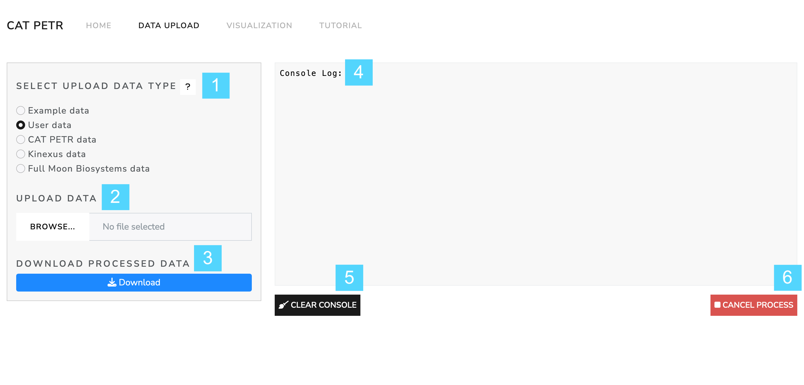
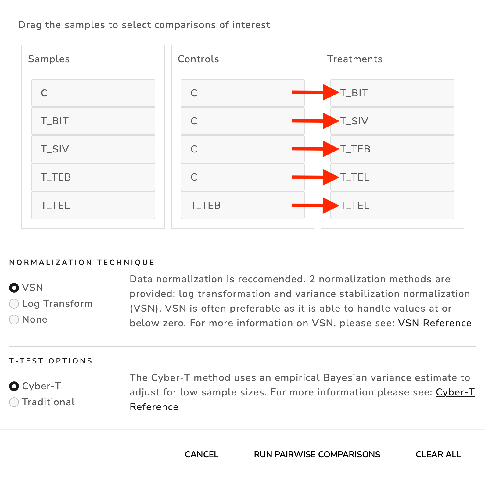

# CAT PETR

CAT PETR (Convenient Analysis Tool for Phosphorylation and Expression Testing in R) is an R shiny application that provides a user friendly interface for the statistical analysis and visualization of phosphorylation and/or expression data.

# Installation

CAT PETR has been developed in R 4.2.1 and Shiny 1.7.2 and uses a wide variety of different packages. For ease of use, CAT PETR is provided as web application using shinyapps.io servers. This web application can be accessed using this link: <https://keegan-flanagan.shinyapps.io/CAT-PETR/> If you wish to run CAT PETR on your local computer, you will first need to Install R and R studio using the instructions from this link <https://www.r-project.org/> and this link <https://www.rstudio.com/products/rstudio/download/> respectively. Then, download or clone this GitHub repository using the green 'code' button at the top of the repository. Now, open and run the 'Install_Dependencies.R' file in Rstudio. After the dependencies are done installing, open up the app.R file and run the app by hitting the Run App button in Rstudio or by running the shiny::runApp() command. This should open up the app on your personal computer.

# Tutorial

This is a simple tutorial that covers the data upload and visualization sections of CAT PETR when working with un-processed protein phosphorylation data. The example data used is antibody microarray data collected from biopsied pancreatic cells from patients who underwent 5 different drug treatments: No treatment (C), treatment with B-IT (T_BIT), treatment with Sivelestat (T_SIV), treatment with Tebipenum (T_TEB), and treatment with Telaprevir (T_TEL).

## Data Upload Tab

1.  The example data for this tutorial can be found on the CAT PETR OSF page <https://osf.io/qmd8e/>. Please save the data from the un_processed folder onto your computer in its own folder.

2.  Go to the 'Data Upload' tab. The appearance of this tab is shown below.

    (1) Selection boxes specifying if uploading un-processed data, pre-processed data, or the raw data files from a Kinexus KAM-1325 microarray. Question mark brings up example input formats. (2) Data upload section. (3) Button which downloads processed data as a .zip file. (4) Console log which displays the analysis progress along with warnings, errors, and messages. (5) Button which clears the console log. (6) Button which cancels any active analysis processes.

3.  Choose the 'un-processed' option for the data upload type. Then, click on the browse button and navigate to wherever you have saved the un-processed data. Note that each data file will represent a single sample/treatment group. Use the shift key to select all of the csv files and upload.

4.  You will notice that three additional input options appear.

    

    The first allows the user to enter what name was used in the Phosphorylation site (P_site) column to specify that the row contains pan-specific phosphorylation data. The second allows the user to clarify if they are interested in analyzing pan-specific data or phospho-site specific data. These two input options will only appear if an optional P_site column is present in the data. For now, leave both inputs as the defaults.

    The last new input is the 'choose comparisons' button which will be used to decide which of our samples we want to statistically compare to each other. Click this button and move on to the next step.

5.  Clicking the 'choose comparisons' button brings up a modal which contains 3 bucket lists. These lists allow the user to drag and drop their samples into the control or treatment categories. Samples in the control category are compared to samples in the treatment category that are directly adjacent to them as demonstrated in the image below. Please choose controls and treatments to match this image.

    

    Once the controls and treatments are selected, the user must choose the style of data normalization they wish to use (if any) and choose which type of t-test to perform. The t-test options include a traditional two-sample t-test and an adjusted Cyber-T t-test. For more information on Cyber-T, please see the [Cyber-T Reference](https://pubmed.ncbi.nlm.nih.gov/22600740/).

6.  Please select the Cyber-T t-test and then hit the 'run pairwise comparisons' button. The comparison should be completed in under 30 seconds. Once completed, we can move on to the next section of the tutorial.

## Visualization Tab

The visualization tab contains three sub-tabs: the Volcano Plot tab, the Scatter Plot tab, and the Heatmap tab. We are going to start with the Volcano Plot tab.

### Volcano Plot

7.  Switch over to the the visualizations tab using the tab-bar at the top of CAT-PETR. The volcano plot will load automatically after you switch tabs and should have the appearance shown below:

    

    Generally speaking, All three of the visualization sub tabs can be broken into three sections: (1) A side-panel with various inputs that alter the plot parameters and buttons to download the plot data. (2) an appearance drop down menu which allows for superficial alterations to the appearance of the plots. (3) A main panel which contains the plot itself and a gene/protein search bar that allows for specific genes to be labelled on the plot.

8.  Use the sidebar to alter the parameters of the volcano plot in the following ways:

    1.  Add the P_sites to the volcano plot labels using the checkboxes.
    2.  Reduce the number of top labelled proteins to 10.
    3.  Adjust the log10 P-value cutoff to 2 and the log2 fold change cutoff to 1.5.

9.  Use the appearance option menu to alter the appearance of the volcano plot in the following ways:

    1.  Increase the size of the plot to 760 width by 590 height.
    2.  Increase the label text size to 5.
    3.  Change the color of the searchbar points.

10. Highlight specific genes/proteins using the protein search bar in the following ways:

    1.  Begin typing the protein name 'PKCg T655 PK083' into the search bar and then select it from the resulting drop down menu. Note that the protein becomes labelled in green on the plot. Select 'PKCg T655 PK083' on the search bar by clicking on it and then remove it using the delete key.
    2.  Click on any random point on the graph to add it to the search bar and generate a label. Then click on the point again to remove it.
    3.  Click the 'add top entries to search bar' button. Note that the color of the labels have all switched to the color we specified in step 9.

11. Switch to the 'C_vs_T\_SIV' plot using the slider directly underneath the plot.

12. Download a .svg image of the plot by clicking on the small camera icon displayed on the upper right hand corner of the plot.

13. The buttons at the bottom of the sidebar allow the user to either download all of the data for the currently viewed volcano plot, or just the data from genes/proteins that are currently in the sidebar. For now, hit the button that downloads just the search bar data and save the resulting tsv file on your computer.

### Scatter Plot

The scatter plot tab works very similarly to the volcano plot tab in many ways. As such, the details of downloading the plot and its data, the contents of the sidebar and appearance menu, and how to add/remove proteins from the search bar will not be covered in this tutorial.

The major difference of the Scatter plot section is that in order to view the scatter plot it is necessary for the user to define which axes will show the fold changes from which comparison.

14. Switch to the scatter plot sub-tab. There should be no visible plot and the sub-tab will have the appearance shown below.

    

15. Hit the 'define axes' button to bring up a modal which, similarly to step 5, brings up 3 bucket lists (see image below). Just like in step 5, we can drag our comparisons over to the X and Y axes boxes to determine what data will be shown on the graphs. Drag and drop the comparisons to match the image below and then hit the generate plots button.

    

16. Hit the deselect all button below the gene/protein searchbar in order to clear it.

17. Click the 'add top entries to search bar' button.

### Heat map

The Heatmap sub tab is unique in that the contents of the plot are entirely dependent on the contents of the gene/protein searchbar. If the gene/protein searchbar is empty, then no plot will appear. The contents of the searchbar should be full from step 17.

18. Switch to the heatmap sub-tab. The heatmap should load automatically and should have the appearance shown below.

19. Mouse over the heatmap to observe the information popups that appear for each tile.

20. Use the sidebar to alter the parameters of the heatmap in the following ways:

    1.  Remove the 'T_TEB_vs_T\_TEL' comparison from the heatmap by un-checking it.
    2.  Change the color bar color choice to "Red Yellow Blue".
    3.  Adjust the colorbar range to -7 and 7.
    4.  Enter 1 into the 'sort by nth column' input to sort the heatmap by the first column.

21. Use the appearance option menu to alter the appearance of the volcano plot in the following ways:

    1.  Decrease the label size to 11.
    2.  Decrease the tile width to 35.
    3.  Decrease the tile height to 20.

22. Save the plot as a .svg using the small camera icon on the upper right corner of the heatmap.

23. Download the plot data using the button at the bottom of the sidebar.

Please consult the User Manual for further details.

| Keegan R. Flanagan, University of British Columbia
| Khanh Dao Duc, University of British Columbia
| Yossef Av-Gay, University of British Columbia
